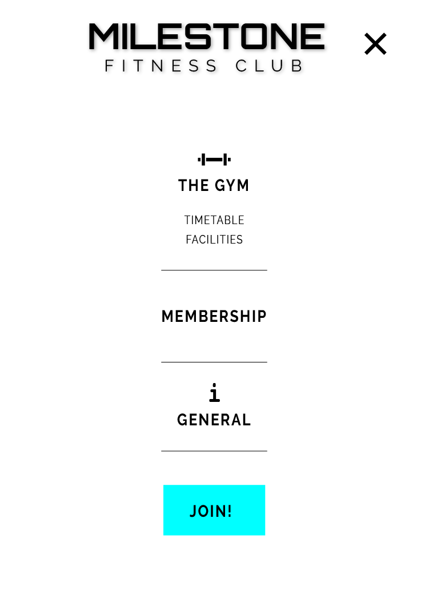
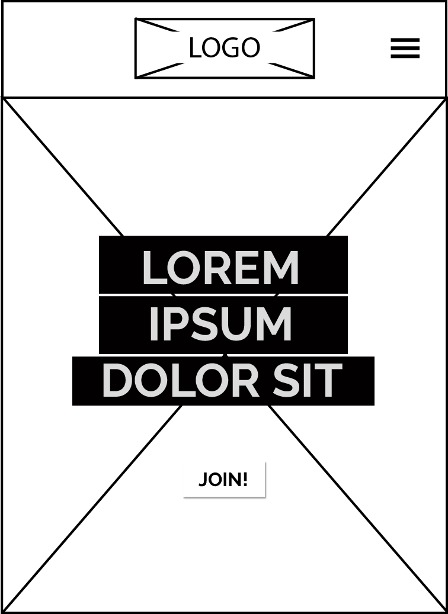
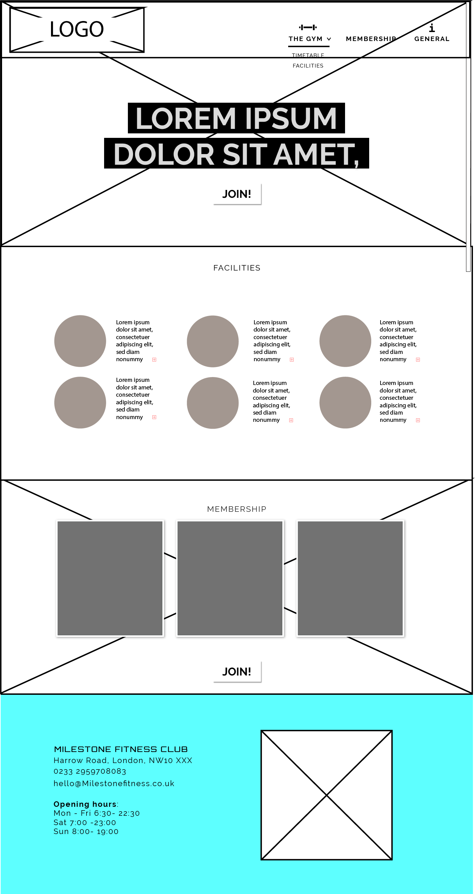

# Milestone Fitness Club

#### Stream One Project: User-Centric Frontend Development - Code Institute

Milestone Fitness Club is a fictional gym website. It provides details about the location of the gym, it's opening hours, facilities, classes and membership costs. It serves as both a marketing platform to encourage new sign-ups and as platform for existing customers looking for key information.

## Demo

A live demo can be found [here](https://fran2488.github.io/milestone-fitness/)

## UX

### Strategy
The overall aim is to attract new sign-ups and acheive the satisfaction and retention of existing members.
The website will enable users to find practical information about the gym to maximize their enjoyment of what is on offer (Appropriate classes, Awareness of opening times, Participation in events and challenges, access to support).
The target audience may be from different demographics. They are apirational individuals and may be looking to make a lifestyle change. The gym serves to help them commit to their goals and the project outcome should be positive, energetic and optimistic.

### Scope 
- The gym location, contact details, opening hours and membership costs are all vital pieces of information that should be available. 
- The facilities and class schedule are key to providing information about the value of joining Milestone Fitness Club.
- A downloadalbe downloadable timetable should be available to all users to be used as a reference tool.

Although it would be nice to have a feature that provides details of daily or weekly challenges, this would require skills beyond my scope, and should be left for a future feature.

### Structure
The Facilities section will provide photos and short descriptions of the facilities at the gym
A small map will appear in the general information section, but only on larger screen sizes.

### Skeleton
The Navigation menu is collapsed into a burger icon on mobile deives. The icon sits within a header at the top of the page and clicking on it triggers the navigation pane to slide in from off screen on the right. 

On larger devices, the navigation menu appears to have expanded. This is a separate header, not displayed on smaller devices. It is displayed over the background 'hero' image as opposed to appearing before it. 
#### Wireframes

### Surface
I chose to use Cyan and Magenta in my color scheme as I wanted the page to feel vibrant and energetic. The 'Orbitron' typeface from google fonts was chosen for the Milestone logo for it's modern and geometric form, as it helped to portray both robustness and refinement. I paired it with the Raleway font for use in the body text, as it was equally modern and appropriately legilble.

### User Stories
- As a customer looking to join a gym, I want to know what this gym has to offer and whether it will provide value for money
- As a customer looking to join a gym, I want find out where the gym is located and what time it opens
- As an existing gym member, I want to access the class schedule to see when my prefered class is available

## Features

### Existing Features
1.  ### Facilities
    Showcases what the gym can offer its mambers to serve their personal fitness journey. For example, a swimming pool, 2 studios, a fully quipled gym and a snack bar

1. ### Timetable: 
    A downloadable schedule to provide members with timings for the available classes.

1. ### Membership: 
    Provides 3 different membership options and the cost of each.

1. ### General information
    Provides other key information such as the location, contact details and opening hours.
 

### Features Left to Implement
- In the future I would like to provide details of daily or weekly challenges. This would help keep members engaged and motivated.
- Create a Members Section so that the login feature fully functions in taking the user to their own account page.

## Technologies Used

- **HTML** 
    Used for the general structure and flow of the page
- **CSS** 
    Used for overall styling and to add animations to the Navigation elemements
- **Bootstrap 4.4.1** 
    Used for providing repetitive styling to elements such as *text-uppercase* and also helped to create responsive layout in the 
- The project uses **Javascript** is used to provide the response to onclick functions- toggling a navigation menu to slide in 

## Testing
I tested my page using the Google Developemt Tools

## Deployment

My website was developed using the Gitpod IDE and pushed to GitHub where the deployed website and repositories are hosted.

To deploy the website on GitHib I did the folowing:

Clicked on Settings
Scrolled down to the GitHub Pages section
Under 'Source' I chose 'master branch' from the dropdown menu
The page  automatically refreshed, with a detailed ribbon display GitHub Source Saved Pages indicating the successful implementation.
The link to the website I found in the GitHub Pages section, with a ribbon notification that states:

## Credits

### Content
The animated burger icon was borrowed from[w3schools](https://www.w3schools.com/howto/tryit.asp?filename=tryhow_css_menu_icon_js)
The navigation animations were inspired by my past experiments with html based on the following

### Media
- The photos used in this site were obtained from Pexels.com.
Background image of [woman jumping](https://www.pexels.com/photo/photo-of-woman-jumping-1921761/): Photo by Tim Savage from Pexels

Background image of [man carrying barbel](https://www.pexels.com/photo/man-carrying-barbel-791763/): Photo by Victor Freitas from Pexels

Yoga [roundel](https://www.pexels.com/photo/people-exercising-892682/): Photo by Tim Savage from Pexels

Weights [roundel](https://www.pexels.com/photo/bodybuilding-close-up-dumbbells-equipment-260352/): pixabay

Cardio [roundel](https://www.pexels.com/photo/an-on-treadmill-1954524/): Photo by William Choquette from Pexels

Water [roundel](https://www.pexels.com/photo/three-clear-water-bottles-2479095/): Photo by Suzy Hazelwood from Pexels

Shower [roundel](https://www.pexels.com/photo/black-shower-head-switched-on-161502/): pixabay

Pool [roundel](https://www.pexels.com/photo/people-doing-swim-race-1263349/): Photo by Jim De Ramos from Pexels

### Acknowledgements

